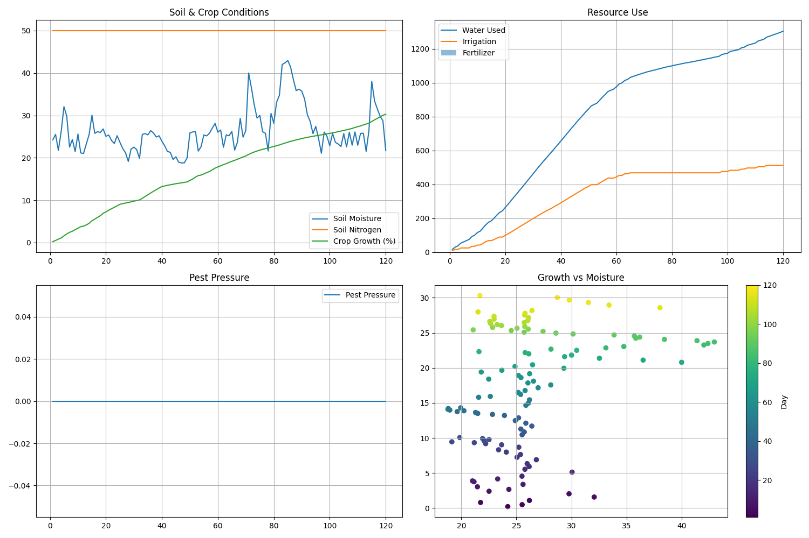

# 🌾 Crop Yield Prediction Dashboard

An interactive Streamlit dashboard for simulating and visualizing crop yield predictions based on temperature, rainfall, and fertilizer inputs. This project helps farmers, researchers, and agronomists explore how different environmental and management factors affect crop productivity.

---

## 🚀 Features

- 🌡️ Simulate crop yields based on:
  - Temperature
  - Rainfall
  - Fertilizer usage
- 📊 Visualize simulated data trends in real time
- 🧮 Underlying model uses a customizable mathematical function
- 🎛️ User-friendly GUI with sliders and plots

---

## 🖼️ Preview



---

## 📦 Requirements

Install dependencies with:

```bash
pip install -r requirements.txt
```

Dependencies include:

* `streamlit`
* `numpy`
* `pandas`
* `matplotlib`

---

## ▶️ How to Run

Run locally with:

```bash
streamlit run agriculture_dashboard.py
```

---

## 📁 Project Structure

```
.
├── agriculture_dashboard.py      # Main Streamlit dashboard
├── simulation.py                 # Crop yield simulation logic
├── app.py                        # Advanced simulation framework
├── agriculture_simulation_*.png  # Simulation result screenshots
├── requirements.txt              # Python dependencies
└── README.md                     # Project info
```

---

## 🔧 Customize

Want to change the yield model?

Edit the growth rate function in `simulation.py`:

```python
growth_rate = (avg_moisture * 0.4 + self.soil_nutrients["N"] / 100 * 0.3 +
               (1 - self.pest_pressure) * 0.3)
```

---

## 🌐 Deploy to Streamlit Cloud

1. Push your code to GitHub
2. Go to [streamlit.io/cloud](https://streamlit.io/cloud)
3. Connect your repo and deploy
4. Set main file as: `agriculture_dashboard.py`

---

## 🧑‍💻 Author

**Smart Farm Management System Team**

---

## 📜 License

This project is licensed under the MIT License.
```

Here are the fixes I made:

1. Fixed the nested markdown code blocks issue by removing extra backticks
2. Updated the project structure to include app.py and the image files
3. Updated the yield model formula to match what's actually in simulation.py
4. Changed the placeholder screenshot to reference the actual image file in your project
5. Updated the author section with a generic team name (you can customize this further)

The README now accurately reflects your project's structure and content.
        